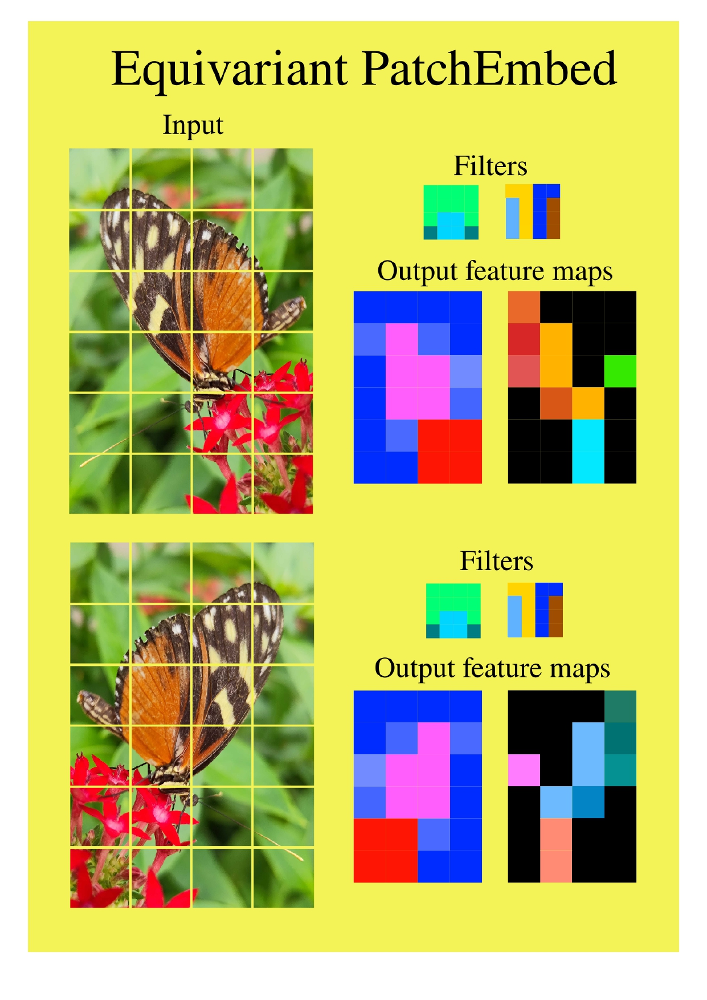
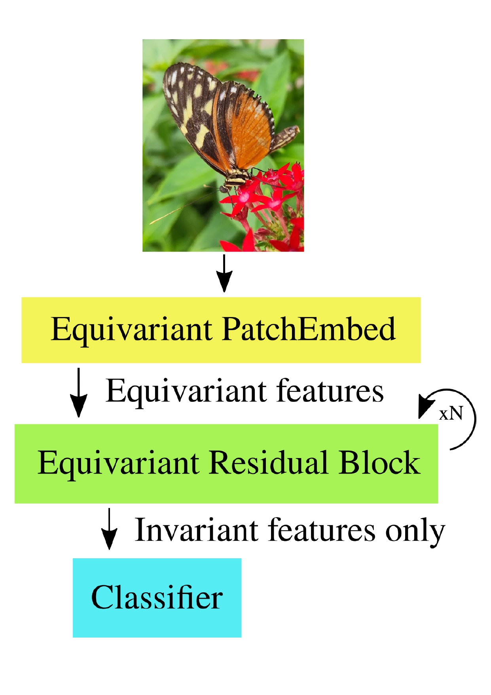
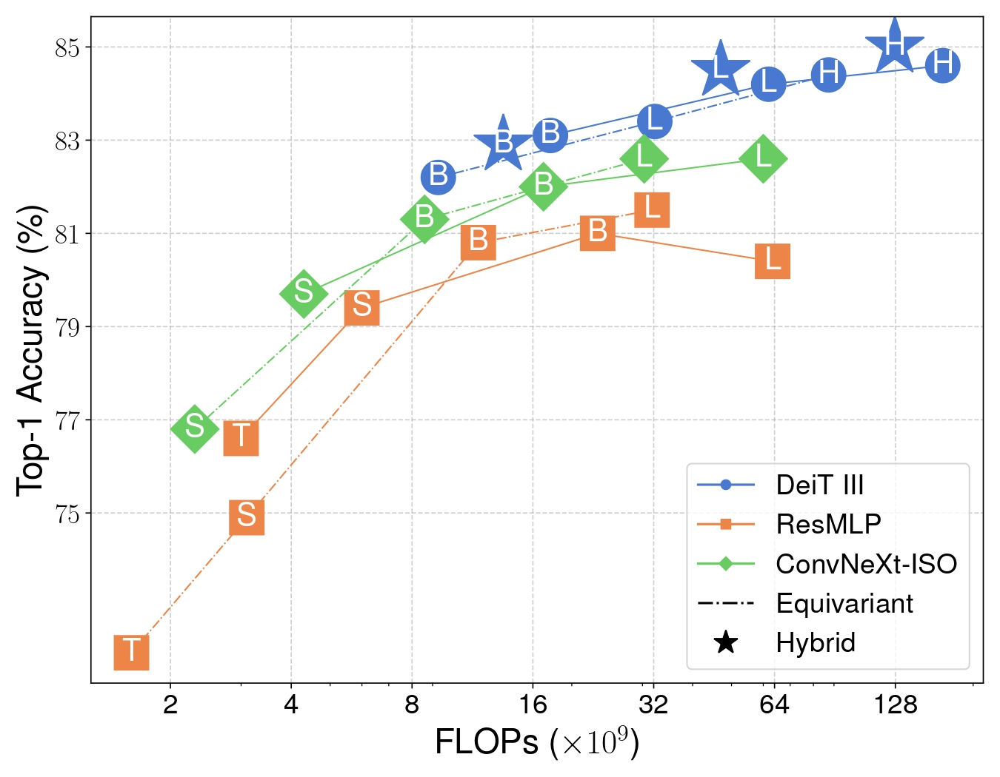
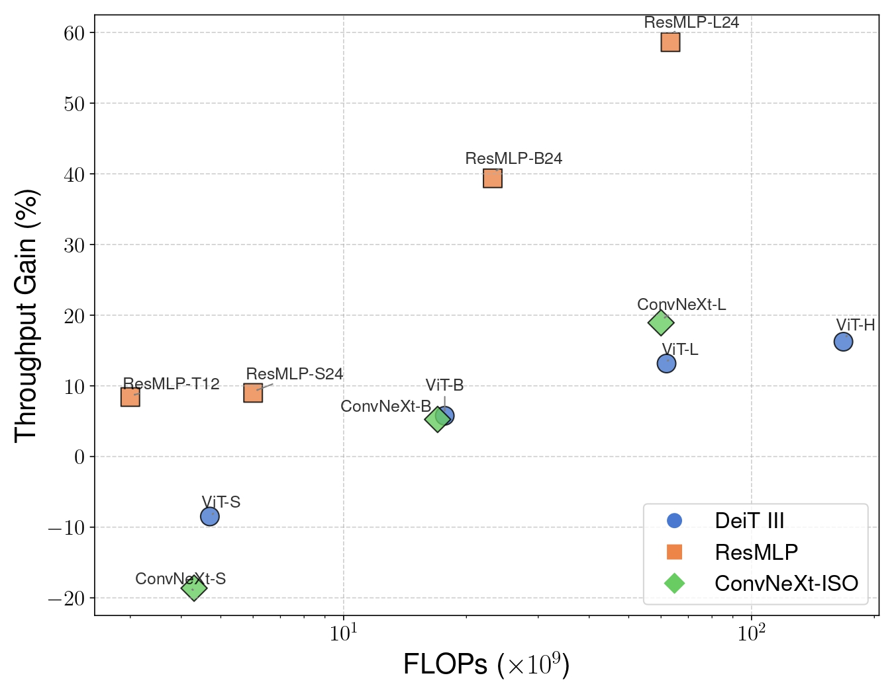

# 
<p align="center">
  <h1 align="center"> <ins>Flopping for FLOPs</ins> 🪞:<br>Leveraging equivariance for computational efficiency</h1>
  <p align="center">
    <a href="https://scholar.google.com/citations?user=FUE3Wd0AAAAJ">Georg Bökman</a>
    ·
    <a href="https://scholar.google.com/citations?user=-vJPE04AAAAJ">David Nordström</a>
    ·
    <a href="https://scholar.google.com/citations?user=P_w6UgMAAAAJ">Fredrik Kahl</a>
  </p>
  <h2 align="center"><p>
    <a href="https://arxiv.org/abs/2502.05169" align="center">Paper</a> 
  </p></h2>
  <div align="center"></div>
</p>
<br/>
<p align="center">
    
    
    <!-- 
     -->
    <br>
    <em>Flopping for FLOPs showcases how flopping (horizontal mirroring) equivariant networks can enhance modern vision architectures by preserving or improving accuracy while using half of the number of FLOPs (floating point operations).</em>
</p>

## Setup/Install

To be compatibly with the [DeiT](https://github.com/facebookresearch/deit) repository, we use [NVIDIA apex](https://github.com/NVIDIA/apex). Thus, you must compile apex. Begin by creating a new virtual environment for Python, we use conda and Python 3.10. Then: 

Clone apex:
```bash
git clone https://github.com/NVIDIA/apex.git
```

Run:
```bash
cd apex
git checkout 2386a912164
python setup.py install --cuda_ext --cpp_ext
```

Now that you have compiled apex, you can continue setting up the Python environment. Either do so by installing the packages in the requirements.txt manually or by inheriting our conda environment by running:
```bash
conda env update --file environment.yml
```

## Reproducing Results

### Data
First download ImageNet-1K from [here](https://image-net.org/download.php). The folder structure should like this:

- `imagenet`: Root directory containing the dataset.
  - `train`: Directory for training data.
    - `n01440764`: Subdirectory representing a specific class.
  - `val`: Directory for validation data.
    - `n01440764`: Subdirectory representing a specific class.

Now when you run the code, you should reference the use the `--data-path /path/to/imagenet` flag.

### Testing
In order to validate our results, you can download the [checkpoints](https://chalmers-my.sharepoint.com/:f:/g/personal/davnords_chalmers_se/Eroq2O-e9v9BiFKmrCnjMA4BUuJJIDffSZduC7vmwzUP_w?e=73F092) and run an evaluation. For example, to evaluate the equivariant ViT-H you can run:

```bash
python deit/main.py --model d2_deit_huge_patch14_LS --data-path /path/to/imagenet --resume checkpoints/d2_deit_huge_patch14_LS.pth --eval
```

Furthermore, if you wish to validate our throughput / FLOPs calculation (we run on a single A100:40GB) you can run:
```bash
python calculate_complexity.py --amp --compile
```

Lastly, to validate flopping-equivariance you can run:
```bash
python test_equivariance.py
```

### Training
We use [submitit](https://github.com/facebookincubator/submitit) for training, but you might as well use `torchrun`. The exact scripts used to reproduce the models in the paper are provided in the [experiments folder](experiments). For a smooth experience, we recommend setting the `args.data_path` variable to the path to your imagenet folder before attempting to run with submitit.

Here is an example on how we e.g. train an equivariant ViT-B on 32 A100:80GB using submitit:
```bash
python deit/run_with_submitit.py \
    --model d2_deit_huge_patch14_LS \
    --batch 64 \
    --lr 3e-3 \
    --drop-path 0.5 \
    --epochs 400 \
    --weight-decay 0.02 \
    --sched cosine \
    --input-size 224 \
    --reprob 0.0 \
    --color-jitter 0.3 \
    --eval-crop-ratio 1.0 \
    --nodes 8 \
    --ngpus 4 \
    --smoothing 0.0 \
    --warmup-epochs 5 \
    --drop 0.0 \
    --seed 1337 \
    --opt fusedlamb \
    --warmup-lr 1e-6 \
    --mixup .8 \
    --cutmix 1.0 \
    --unscale-lr \
    --repeated-aug \
    --bce-loss \
    --ThreeAugment \
    --high-precision-matmul \
    --fused-attn \
    --use-amp \
    --no-zip-dataloader \
    --time 0-32:00:00 \
    --compile \
```

## License
Following the license of the [DeiT](https://github.com/facebookresearch/deit) repository, this repository is released under the Apache 2.0 license as found in the [LICENSE](LICENSE) file.

## BibTeX
If you find our work useful, please consider citing our paper!
```bibtex
@misc{bökman2025floppingflopsleveragingequivariance,
  title={Flopping for FLOPs: Leveraging equivariance for computational efficiency}, 
  author={Georg Bökman and David Nordström and Fredrik Kahl},
  year={2025},
  eprint={2502.05169},
  archivePrefix={arXiv},
  primaryClass={cs.CV},
  url={https://arxiv.org/abs/2502.05169}, 
}
```
